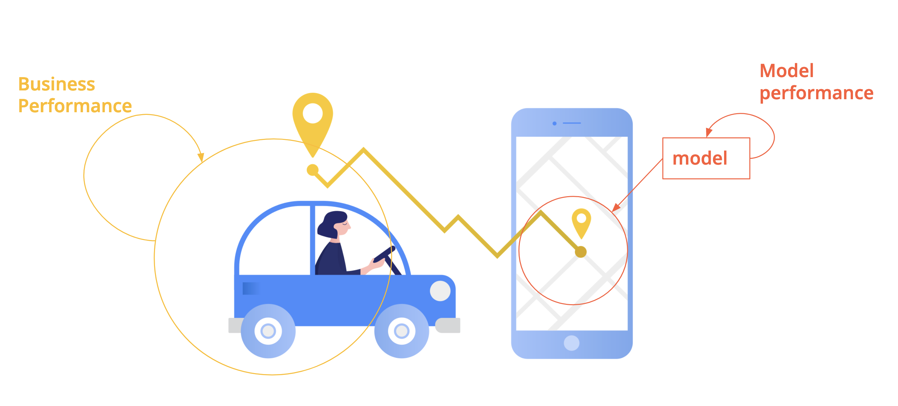
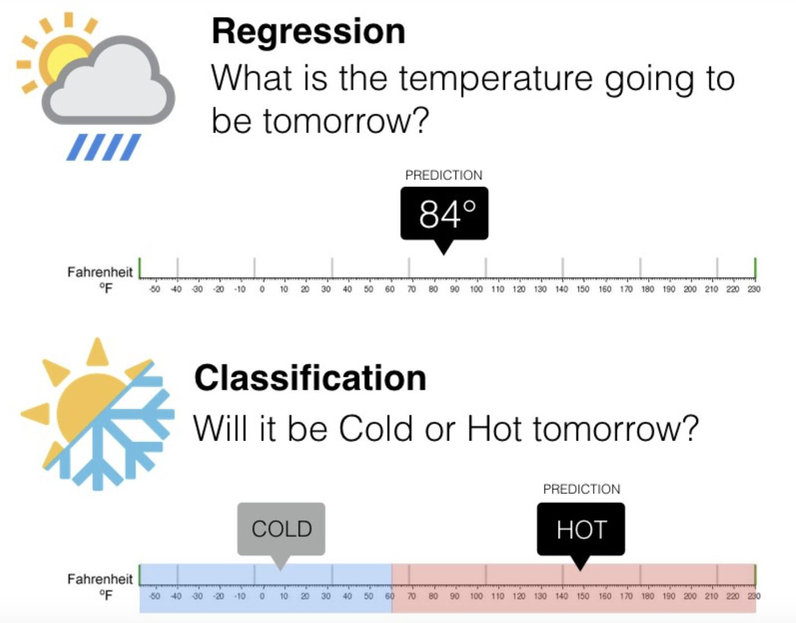

# Daily Review | Designing Data Products

Friday, 07.03.2025

---
##  __Basic Overview__ 
 

*  Exploratory analysis - understand what happened in the past
*  Predictive analyis - predict what will happen
*  Predict what, for whom and for what purpose?

---
##  __Schedule__

|Time|Content|
|---|---|
|09:00 - 10:00|Daily Review|
|10:00 - 12:30|Working on Team Project|
|12:30 - 13:30|Lunch Break| 
|13:30 - 16:00|Working on Team Project|
|16:00 - 16:20|Stand-up|
|16:20 - 18:00|Working on Team Project|

##  __Product = Customer x Business x Technology__ 

* Usability
* Business viability
* Feasibility
  
Value = product of the three
  

##  Measuring Success 

* The first model you build should be the simplest model that could address the product needs.
* Business performance: measured usually by one KPI (key performance indicator)
* Model performance: an offline metric that captures how well the model will fit the business need

##  _Note: The business metric is independent from the model metric... It is a measure of the product success._ 

---
##  __Examples of Measuring Business Performance__ 

Business metrics:
* Click through rate (CTR) - for recommenders
* Usage - model that generates html from hand drawn diagrams
* Adoption by finance team - internal revenue forecasting

##  Measuring Success 

Regression:
* RMSE, RMSLE
* MAPE ( mean absolute percentage error) - accuracy as a ratio

Classification:
* Accuracy
* Precision
* Recall

---
##  __Business Performance vs. Model Performance__ 

---
##  __Relationship Between Business Performance & Model Performance__ 

* Thinking of the business value of your model and the cost of being wrong can help you choose the right model metric.
* Always start from the value!
  

---
##  __Error Analysis__ 

Going beyond aggregated metrics
* Most model performance metrics we’ve seen are aggregated metrics
* They help determine whether a model has learned well from a dataset or needs improvement
* Next step: examine results and errors to understand why and how is the model failing or succeeding
* Validation and Iteration
* Note: Performance metrics can be deceptive, on highly imbalanced datasets a classifier can reach very high accuracy without any predictive power

---
##  __Types of supervised learning__ 

---
##  Validate The Model | Inspect How It Is Performing 

* Regression: looking at residuals, for example doing EDA on residuals and inspecting the outliers
* Classification: one can start with a confusion matrix, breaking results in true class and predictions

---

##  __Confusion Matrix for Classification__ 

Counts how often the model predicted correctly and how often it got confused.
* False Positive: false alarm / type I error
* False Negative: missed detection / type II error

---
##  __Types of Linear Regression__ 

* Simple Linear Regression: One independent variable.
* Multiple Linear Regression: More than one independent variable.

---
##  __Least Squares Criterion__ 

To find the best-fitting line, we minimize the sum of squared residuals (SSR):
* SST (Total Sum of Squares) = Total variability in Y.
* SSE (Explained Sum of Squares) = Variability explained by the model.
* SSR (Sum of Squared Residuals) = Remaining unexplained variability.

---
##  __Evaluation Metrics__ 

* Root Mean Squared Error (RMSE): Measures model accuracy.
* Adjusted R²: Adjusts R² for the number of independent variables. 
    * Adjusted R²: will penalize us for adding more features that don't improve our existing model. For a simple linear regression
and adjusted will be nearly the same. MSE (Mean Squared Error): SSR divided by sample size.
* R (Correlation Coefficient): Measures relationship strength (-1 to 1).
* R² (Coefficient of Determination): Measures variance explained by the model.

##  __| - Key Takeaways -|__ 

* Linear regression models the relationship between a dependent variable and one or more independent variables.
* We can divide linear regression into two categories:
    * Simple linear regression: cases in which we only have one explanatory variable
    * Multiple linear regression: cases in which we have more than one explanatory variable - multiple linear regression is not so easy to display
    * Linear regression can approximate a relationship, but it cannot prove causality.
* Linear regression can approximate a relationship, but it cannot prove causality.
* Correlation measures the strength of the relationship
* Regression quantifies the nature of the relationship
* The model assumes linearity, zero-mean error, exogeneity, homoscedasticity, and no multicollinearity.
    * Linearity: The target variable and the coefficients of the explanatory variables are linearly related.
    * Zero-Mean Error: The mean of all residuals is zero.
    * Strict Exogeneity: All the explanatory variables are uncorrelated with the residual.
    * Homoscedasticity: The variance of the residuals across a single observation remains the same.
    * No Multicollinearity: All the explanatory variables are linearly independent.
* Key evaluation metrics include RMSE, MSE, R², and adjusted R².
* Multiple regression allows for more than one predictor.
* Least squares criterion minimizes prediction errors to find the best fit.

